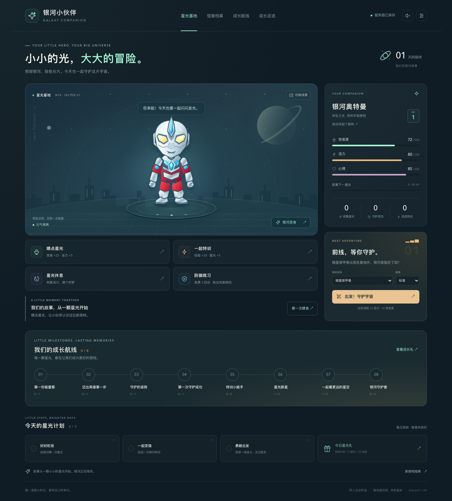
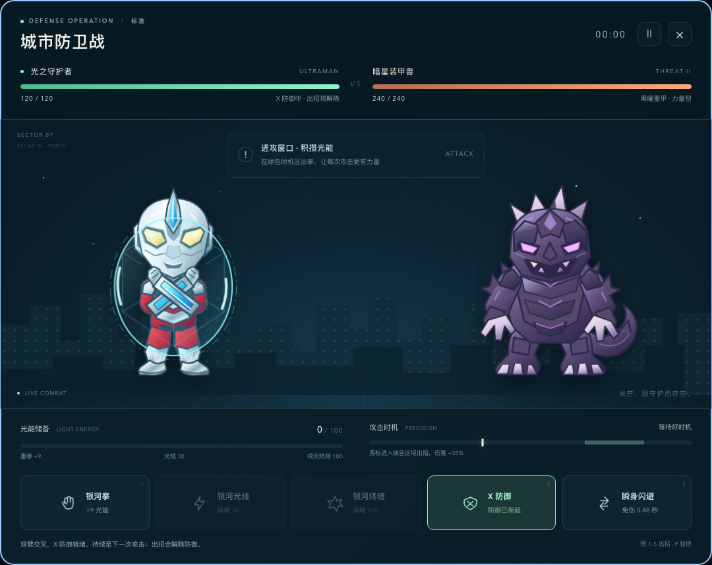
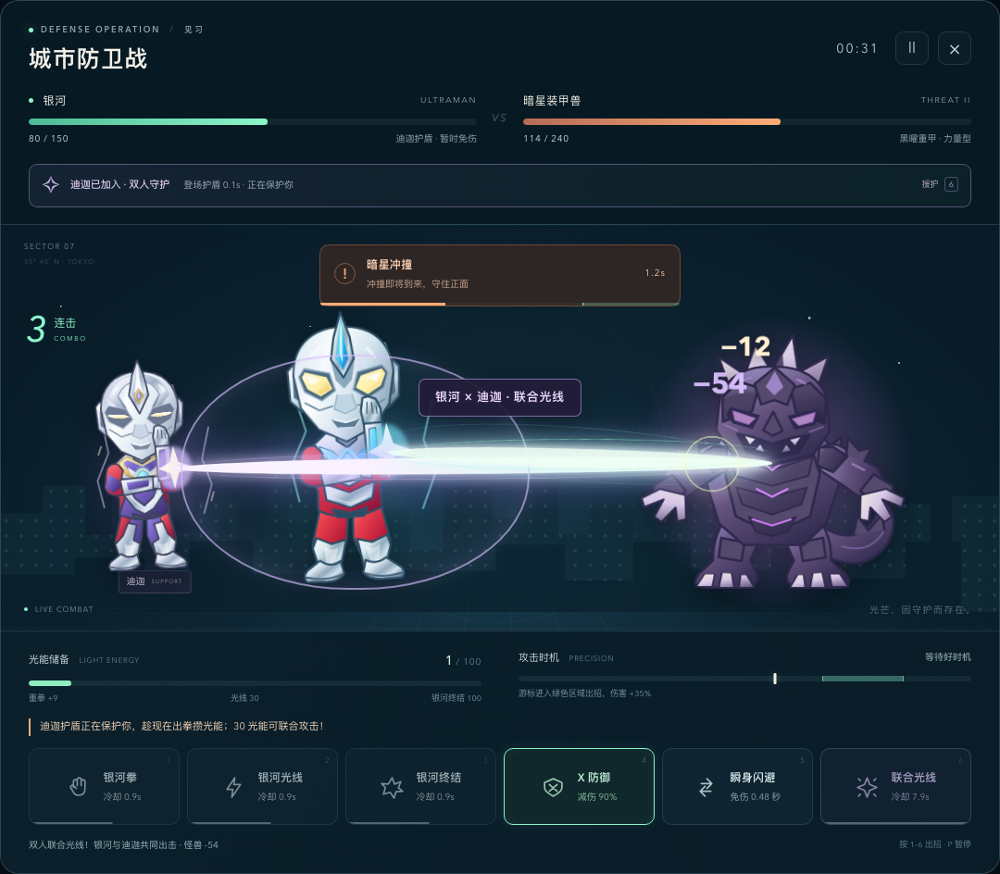
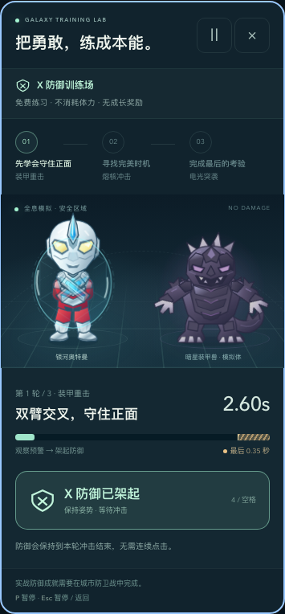

# 银河小伙伴 · 奥特曼电子宠物

可以陪伴、养成和战斗的奥特曼电子宠物。前端使用原生 JavaScript、SVG 和 CSS 动画；Nginx 提供网页和 API 入口，Python + SQLite 在服务器保存成长进度。





## 本轮更新 · v5：最后的光，双人守护

快失败时，可以用剩余的光能呼唤 **迪迦奥特曼**。他从光柱中登场，和你操控的银河一起留在战场，两人都有独立的出拳、光线和胜负动作。

| 阶段 | 规则 |
| --- | --- |
| 濒危求援 | 生命不高于 30%，且至少有 10 光能时，点击「召唤迪迦」或按 **6**；每场一次 |
| 迪迦登场 | 耗尽现有光能，打断怪兽蓄力，恢复最大生命的 25%（向上取整），获得 3 秒免伤护盾 |
| 并肩战斗 | 迪迦在登场 0.8 秒后开始攻击，此后每 2.4 秒交替使用拳击（12 伤害）与光线（18 伤害），一直陪伴到战斗结束 |
| 联合光线 | 援护按钮变成「联合光线」，消耗 30 光能，两人一起造成 54 伤害；冷却 8 秒，与普通攻击共享出招冷却 |

联合攻击后，迪迦的下一次自动攻击从 2.4 秒重新计时。护盾结束后仍需防御；如果生命已经归零，本场就不能再召唤。濒危提示、能量差额、护盾倒计时、双色联合光线及战后援护统计均已加入；手机使用两排共六个操作按钮。

援护战斗的奖励沿用原有规则，在胜负确定时立即写入存档。存档格式与 SQLite 结构保持兼容，升级不会覆盖已有成长进度。



## v4：成长航线与防御训练

可以给伙伴起昵称，并沿着 **8 站成长航线**领取一次性的经验和星光奖励。已有的喂食、特训、格挡、胜场、场景和怪兽记录都会计入目标；基地也会根据伙伴当前状态给出照顾建议。

**防御训练场**提供免费三轮演习：看预警、架起 X 双臂、在最后 0.35 秒挑战完美格挡，再查看每轮成绩。训练不消耗资源、不发成长奖励；正式战斗中的防御仍计入成长目标。按 P / Esc 暂停，切到后台或页面停顿也会暂停。



战斗新增三种怪兽的招式简报、光能差额、冷却秒数及战后建议。修复了鼠标点击攻击进入冷却后，键盘数字快捷键丢失焦点的问题。

新字段继续使用兼容的 v2 存档格式，SQLite 结构版本保持 2，无需重建数据库。旧客户端提交的存档没有昵称和里程碑字段时，API 会保留服务器上的这些字段；恢复历史存档则按明确选择恢复。更新照常运行 `./deploy.sh`，升级前会生成数据库快照。

## 玩法

- **陪伴养成**：喂食、抚摸、休息与特训影响饱食度、活力和心情；升级、出击、完成每日计划可积累成长与星光奖励。
- **自己的小宇宙**：使用星光解锁场景，收集怪兽图鉴，查看成长记录。
- **专属伙伴**：在状态卡给伙伴起昵称，通过成长航线领取 8 个目标的奖励。
- **免费练习**：防御训练场提供三轮普通 / 完美格挡练习，暂停和退出不损失资源。
- **动态战斗**：奥特曼和怪兽都有待机、攻击、受击和行动动画，可观察怪兽的攻击预警。
- **X 防御**：双臂交叉在胸前，普通防御减伤 90%；抓准攻击落点完成完美防御，可免受该次伤害。
- **濒危援护**：用最后的光能召唤迪迦，自动援护与联合光线让两人共同击退怪兽。
- **技能快捷键**：数字 **1–5** 对应原有战斗技能，**6** 召唤 / 联合光线，**P** 暂停，也支持点击和触摸。
- **服务器存档**：进度通过存档 API 写入 SQLite；恢复码用于在手机、电脑或新域名上接回同一名伙伴，界面会显示同步状态。

## 存档保存在什么地方

| 内容 | 位置 | 更新版本时的行为 |
| --- | --- | --- |
| 空 SQLite 模板及结构迁移 | GitHub 中的 `database/initial.sqlite3`、`database/migrations/` | 随代码发布；模板只用于首次创建数据库，迁移升级已有数据库结构 |
| 实际成长进度、玩家凭证及历史 | Docker 数据卷 `aoteman_data` 中的 `/data/aoteman.sqlite3` | 保留原数据，不从仓库模板覆盖 |
| 数据库快照 | 同一数据卷内 `/data/backups/` | 有变化时每 15 分钟自动备份，滚动快照保留最近 48 份，每日快照保留最近 30 份 |
| 升级前、恢复前和手工备份 | `/data/backups/`，可通过脚本导出到主机 | 单独保留，不参与自动快照轮换 |
| 浏览器副本及同步身份 | 当前浏览器的网站数据 | 辅助离线和重试；跨设备使用恢复码读取服务器进度 |

**GitHub 跟踪空数据库模板和迁移脚本；运行中的成长库不提交到 GitHub，也不打进镜像。** 实际数据库包含玩家数据及访问凭证相关信息，发布这些内容会公开玩家进度；让镜像中的旧存档覆盖正在使用的数据库，也会造成进度回退。`.gitignore` 和 `.dockerignore` 已隔离运行库、WAL 和备份。

更新部署会先生成 SQLite 一致性快照，备份失败就停止升级。数据库由 API 事务写入，并用版本号检查避免多个设备直接覆盖彼此的新存档。

已有浏览器的旧版存档会在首次连接服务器时自动迁移。请先在原网址、原浏览器打开新版并等到同步成功，再切换域名；浏览器按网址隔离数据，新网址无法直接读取旧网址的本地存档。也可以使用 JSON 导出 / 导入转移旧存档。

**请保存恢复码。** 它用于访问对应伙伴的存档；更换设备或清理浏览器数据后，通过恢复码继续游戏。恢复码不应出现在截图、公共仓库或访问日志中。

服务器数据卷可以跨容器重建和代码升级保留数据，但不能抵御服务器磁盘损坏。定期将 SQLite 快照导出到服务器之外，才能在整台服务器丢失后恢复。

## 本地一键试玩

先安装并启动 Docker（macOS / Windows 可使用 Docker Desktop；Linux 使用 Docker Engine 和 Compose 插件），在项目目录运行：

```sh
./deploy.sh
```

脚本检查 Docker，备份已有存档，构建并启动两个服务，等待健康检查通过。打开 **http://localhost:8787** 开始试玩。

端口被占用时：

```sh
PORT=8888 ./deploy.sh
```

默认数据卷名称固定为 `aoteman_data`，不随代码目录重命名而变化。仅在明确需要一个独立环境时设置 `AOTEMAN_VOLUME_NAME`；换成另一个卷名会连接另一套存档。

## 服务器部署与域名

```sh
git clone https://github.com/cppla/aoteman.git aoteman
cd aoteman
./deploy.sh
```

默认映射 `8787 → Nginx 8080`，API 的 `8081` 仅在 Docker 内部访问。网页和 `/api/` 共用同一入口，无需单独绑定 API 域名。

将你的域名 A / AAAA 记录解析到服务器，然后把域名的 HTTPS 反向代理目标设为 `127.0.0.1:8787`。例如已有 Caddy 运行在宿主机时，可添加：

```caddyfile
pet.example.com {
    reverse_proxy 127.0.0.1:8787
}
```

把 `pet.example.com` 换成实际域名，并确保域名解析正确、服务器允许 HTTPS 所需的 80 / 443 端口。Caddy 自身也在容器中时，`127.0.0.1` 指向其自身，应将代理加入同一 Docker 网络并转发到 `web:8080`。可参考 [Caddy 自动 HTTPS 文档](https://caddyserver.com/docs/automatic-https)。

使用其他反向代理时，同样将网页与 `/api/` 一起转发，关闭 `/api/` 的 CDN / 代理缓存。更换域名不会移动服务器数据库；在新域名输入原恢复码即可接回原存档。HTTPS 可保护恢复码在传输中的安全。

## 默认服务器与更新约定

本项目后续更新默认完成 **提交并推送 Git → Docker 更新服务器**，具体协作约定见 [AGENTS.md](AGENTS.md)。

- 服务器：`alisg.cloudcpp.com`，SSH 端口 `24`，项目目录 `/opt/aoteman`。
- 试玩入口：`http://alisg.cloudcpp.com:8787`。
- Compose 项目：`aoteman`；成长数据库卷：`aoteman_data`。

代码推送后，在服务器上更新：

```sh
cd /opt/aoteman
git pull --ff-only origin main
./deploy.sh
docker compose ps
```

首次部署已迁移本地试玩快照。新网址与 `localhost` 使用不同的浏览器网站数据：在原本地页面的存档设置中保存恢复码，到服务器页面使用同一恢复码，即可接回原来的伙伴。后续服务器与本地属于两个独立数据库，继续在服务器网址游玩；更新服务器时不再重新导入本地快照。

## 更新版本，保留成长进度

```sh
git pull
./deploy.sh
```

`deploy.sh` 会先调用 SQLite 在线备份接口创建 `/data/backups/pre-deploy-<UTC>.sqlite3`，成功后才构建和更新服务。已有 API 容器状态异常时，脚本保留现场并停止；先查看 API 日志与存档，不会自动删库或重建空库。

普通 `docker compose down` 会删除容器与网络并保留数据卷。再次运行 `./deploy.sh` 时，脚本使用保留的上一版 API 镜像先执行离线备份，再升级。

**不要运行 `docker compose down -v` 或 `docker volume rm aoteman_data`：它们会删除实际成长数据及同卷备份。** 正常更新不需要这些命令。也不要用仓库内的 `database/initial.sqlite3` 手工覆盖 `/data/aoteman.sqlite3`。

## 导出数据库快照

在运行中的项目目录执行：

```sh
# 导出到主机 backups/，同时生成 .sha256 校验文件
./scripts/backup.sh

# 或指定主机位置；路径中的空格需加引号
./scripts/backup.sh /安全备份目录/aoteman-20260907.sqlite3
```

脚本先用 SQLite 备份接口生成一致性快照，再从容器复制到主机临时文件并原子落盘；不会直接复制运行中的数据库主文件而漏掉 WAL 中的最新事务。已有同名文件不会覆盖。备份文件权限为 `600`。

把 `.sqlite3` 和 `.sha256` 文件复制到独立磁盘或私人备份存储。**不要提交含实际玩家数据的快照到公开 GitHub 仓库。** 备份属于管理员数据，可恢复全部玩家；玩家界面的 JSON 导出用于单个伙伴的存档迁移。

## 从快照恢复 / 迁移到另一台服务器

恢复会将整套服务器存档回到快照时间点；快照之后的进度不在该备份中。后端会验证文件和数据库结构，自动保留恢复前旧库快照；API 运行时持有文件锁，禁止直接离线覆盖。

在目标服务器检出对应项目版本、构建 API 镜像后，将备份复制到主机。恢复时先停止服务：

```sh
# 已部署的服务器：停止服务但保留数据卷
docker compose stop web api

# 新服务器或镜像不存在时，先构建（不会启动 API）
docker compose build

# 先核对 .sha256 文件中的摘要与备份文件匹配
LC_ALL=C LANG=C shasum -a 256 /安全备份目录/aoteman-20260907.sqlite3

# 导入已确认的快照；会保留恢复前旧库快照
./scripts/restore.sh /安全备份目录/aoteman-20260907.sqlite3

# 重新启动，等待健康检查
docker compose up -d --wait
```

Linux 也可使用 `sha256sum` 核对摘要。恢复脚本通过标准输入传送备份，因此无需放宽主机文件权限。底层恢复入口为 `python -m server.restore <快照路径>`，必须在 API 服务停止时执行。

恢复失败时脚本不会自动启动服务，原始导入文件保留在 `/data/backups/restore-import.*` 供排查；未通过验证的快照不会替换当前数据库。当前库已经损坏时，显式恢复会先把坏库及 WAL / SHM 原始文件保存到 `/data/backups/damaged-pre-restore-*`，再替换为已验证的备份。

启动后用原恢复码打开伙伴，核对等级、奖励与成长记录。迁移整个数据库后，原恢复码保持有效。

## 容器与 API 检查

```sh
docker compose ps
docker compose logs --tail=100 web api
curl -fsS http://localhost:8787/healthz
curl -fsS http://localhost:8787/api/healthz
curl -fsS http://localhost:8787/api/openapi.json
docker volume inspect aoteman_data
```

| 接口 | 用途 |
| --- | --- |
| `POST /api/v1/profiles` | 新建玩家与存档 |
| `GET /api/v1/save` | 读取本人最新存档 |
| `PUT /api/v1/save` | 根据版本号保存进度 |
| `GET /api/v1/history` | 查询存档历史 |
| `POST /api/v1/restore` | 恢复本人历史存档 |
| `GET /api/v1/export` | 导出本人存档 |
| `GET /api/openapi.json` | 查看接口结构、身份认证和错误定义 |

除健康检查、接口说明和新建玩家外，存档接口需要玩家身份验证。直接查看 OpenAPI 可获得与当前版本一致的请求结构；恢复码与凭证不要放在 URL 查询参数中。

Nginx 使用官方 `nginx:1.30.4-alpine`，API 使用官方 `python:3.13-slim` 和 Gunicorn（1 个 worker、4 个线程），SQLite 由 Python 标准库提供。两个服务都以非 root 身份运行、根文件系统只读，临时目录使用 tmpfs，日志自动轮转。API 仅向 `/data` 写入持久数据。

## 开发与验证

前端位于 `public/`，后端位于 `server/`，数据库模板和迁移位于 `database/`。完整存档体验需要 API，请使用 Docker 运行；纯静态 HTTP 预览无法测试服务器同步。

```sh
docker compose config --quiet
sh -n deploy.sh scripts/backup.sh scripts/restore.sh
npm test
python3 -m unittest discover -s tests -p 'test_*.py'
```

浏览器测试（先启动本地服务）：

```sh
pnpm install --frozen-lockfile
pnpm exec playwright install chromium
pnpm test:browser
# 测试其他地址：BASE_URL=http://localhost:8888 pnpm test:browser

# 存档同步浏览器回归，默认连接独立测试服务 http://localhost:8789
pnpm test:sync-browser
pnpm test:battle-save
pnpm test:growth
pnpm test:dojo
pnpm test:battle-polish
pnpm test:ally
# 指定其他隔离测试地址：BASE_URL=http://localhost:8890 pnpm test:sync-browser
```

存档同步回归会创建测试玩家，应连接独立测试数据卷，避免把虚构存档写进日常试玩数据库。例如先用 `PORT=8789 AOTEMAN_VOLUME_NAME=aoteman_sqlite_integration COMPOSE_PROJECT_NAME=aoteman-sqlite-integration ./deploy.sh` 启动隔离服务，再运行 `pnpm test:sync-browser`。

重点检查旧存档迁移、刷新保留、断线重试、跨标签和跨设备同步、版本冲突、恢复码接回、JSON 导入导出，以及容器重建后存档仍可读取。Playwright 仅用于开发，不进入运行镜像；截图及临时数据写入 Git 忽略的 `test-results/`。

自动测试、隔离容器验证、本地试玩和远程生产环境是不同层级的证据，以实际运行结果为准。

v3 存档验证记录见 [validation-v3.md](docs/validation-v3.md)；成长与训练见 [validation-v4.md](docs/validation-v4.md)；本轮双人援护见 [validation-v5.md](docs/validation-v5.md)。

## 说明

这是非商业同人练习项目，与奥特曼官方无隶属或授权关系。相关角色名称与原作权利归各自权利人所有。请勿将本项目用于冒充官方、商业售卖或侵权传播。代码许可见 [LICENSE](LICENSE)。
